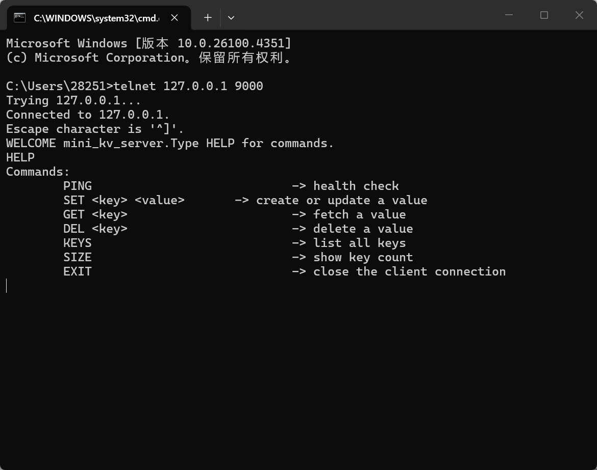
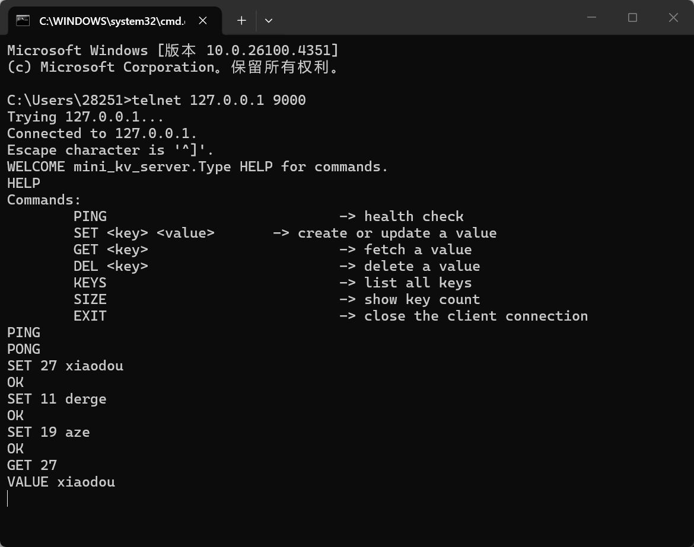
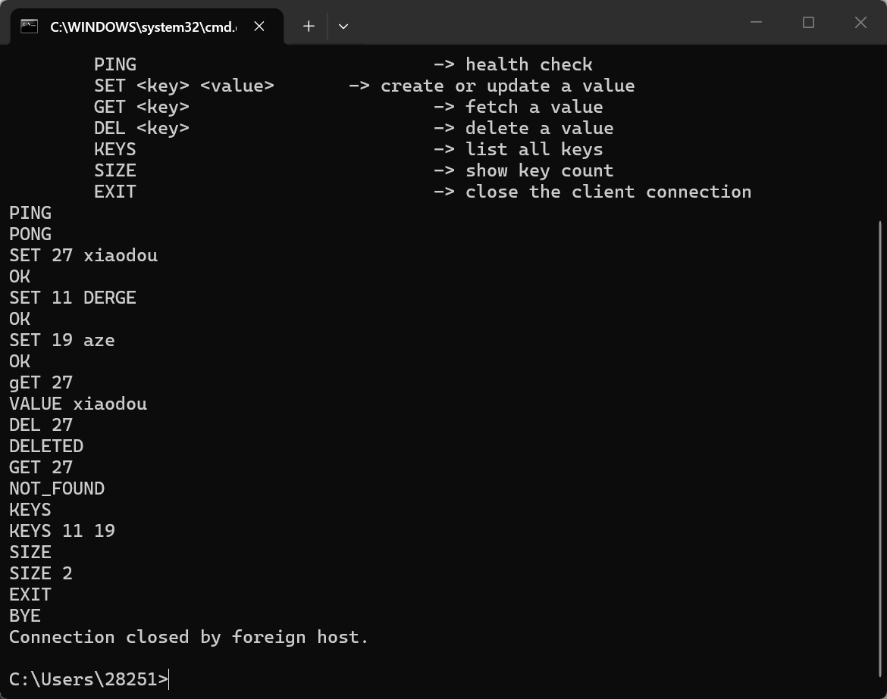
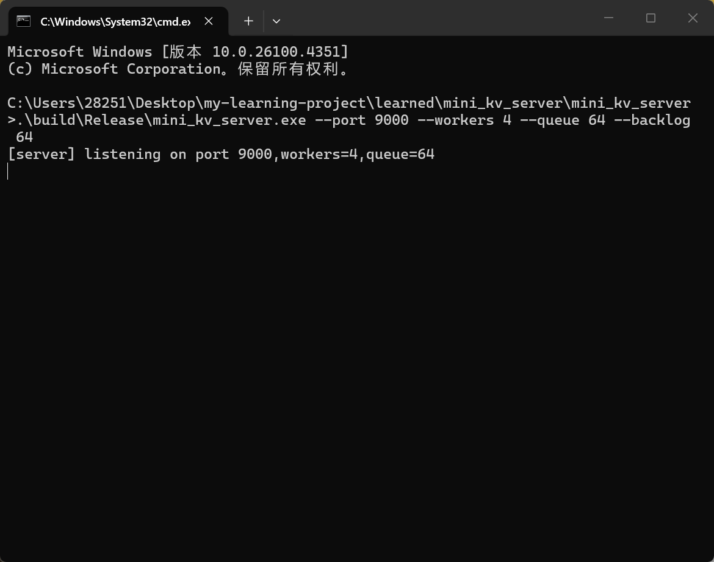

# MiniKV Server

MiniKV Server 是一个基于 C++17 实现的轻量级 TCP 键值服务器。项目规模不大，但它覆盖了 C++ 后台开发里很基础也很重要的一组问题：socket 生命周期管理、RAII、move-only 资源封装、线程池、有界任务队列、读写锁、TCP 字节流解析和 CMake 工程组织。

这个项目不是为了做一个完整数据库，而是为了把 C++ 基础、网络编程和并发模型串成一个能编译、能运行、能解释设计取舍的小型服务端项目。

## 功能

服务端监听一个 TCP 端口，客户端连接后可以通过文本命令操作内存中的 key-value 数据：

```text
HELP
PING
SET <key> <value>
GET <key>
DEL <key>
KEYS
SIZE
EXIT
```

示例交互：

```text
PING
PONG

SET 27 xiaodou
OK

GET 27
VALUE xiaodou

DEL 27
DELETED

GET 27
NOT_FOUND
```


## 项目结构

```text
mini_kv_server/
  CMakeLists.txt
  include/
    minikv/
      core/
        command.h
        key_value_store.h
        thread_pool.h
      net/
        socket.h
        socket_runtime.h
      server/
        server.h
  src/
    core/
      command.cpp
      key_value_store.cpp
      thread_pool.cpp
    net/
      socket.cpp
      socket_runtime.cpp
    server/
      server.cpp
    main.cpp
```


## 构建与运行

### Windows

建议使用 Visual Studio 2022 Developer PowerShell，或者已经配置好 MSVC 环境的终端：

```powershell
cmake -S . -B build
cmake --build build --config Release
```

运行服务端：

```powershell
.\build\Release\mini_kv_server.exe --port 9000 --workers 4 --queue 64 --backlog 64
```

服务端启动成功后会输出：

```text
[server] listening on port 9000,workers=4,queue=64
```

### Linux/macOS

```bash
cmake -S . -B build
cmake --build build
./build/mini_kv_server --port 9000 --workers 4 --queue 64 --backlog 64
```


## 测试

本项目包含两类测试：

- C++ 单元测试：验证命令解析和 KeyValueStore 的基础行为。
- Python 冒烟测试：通过 TCP 连接真实服务端，验证 PING/SET/GET/DEL/SIZE/EXIT 主流程。

### 运行 C++ 单元测试

```bash
cmake -S . -B build -DCMAKE_BUILD_TYPE=Release
cmake --build build
ctest --test-dir build --output-on-failure
```

如上图所示，已在 `Ubuntu` 下通过 `CMake/CTest` 验证


Windows + Visual Studio 生成器：

```powershell
cmake -S . -B build
cmake --build build --config Release
ctest --test-dir build -C Release --output-on-failure
```

### 运行 smoke test

先启动服务端：

- `Windows` 是：

```powershell
.\build\Release\mini_kv_server.exe --port 9000 --workers 4 --queue 64 --backlog 64
```

- `Linux` 应该是：

```bash
./build/mini_kv_server --port 9000 --workers 4 --queue 64 --backlog 64
```

再打开另一个终端：

```bash
python tests/smoke_test.py
```


## 客户端测试

可以使用 `telnet` 连接服务端：

```powershell
telnet 127.0.0.1 9000
```

连接后输入 `HELP` 查看命令：



写入和读取键值：



删除 key、查看 key 列表、查看数量并退出：



服务端运行状态：



注意：**服务端窗口不是交互式命令行**，不能直接输入 `PING` 或 `SET`。命令需要在客户端窗口输入，服务端只负责监听端口和处理连接。


## 实现要点

### RAII 与 socket 生命周期

Windows 下 socket API 需要先调用 `WSAStartup()`，退出时调用 `WSACleanup()`。项目中用 `SocketRuntime` 管理这对初始化和清理操作。

`Socket` 类负责管理原生 socket 句柄，析构时自动关闭，避免忘记释放资源。

### move-only Socket

socket 句柄代表操作系统资源，不应该被随意拷贝。如果两个 C++ 对象持有同一个句柄，析构时就可能重复关闭。因此 `Socket` 禁止拷贝，只允许移动，让资源所有权转移变得明确。

### 线程池与有界队列

服务端接受客户端连接后，会把连接处理逻辑投递到线程池。任务队列设置了最大长度，队列满时返回 `BUSY`。这种设计能避免请求无限堆积，也能体现服务端过载时的背压处理思路。

### shared_mutex 保护 KV 存储

KV 数据存储在 `std::unordered_map` 中，并由 `std::shared_mutex` 保护。读操作使用共享锁，写操作使用独占锁，适合读多写少的场景。

### TCP 字节流解析

TCP 是字节流，不保证一次 `recv()` 就刚好读到一条完整命令。项目中使用 `pending` 缓冲区保存未处理完的数据，直到遇到 `\n` 才切分出一条命令。

## 当前限制与后续优化

- 当前使用阻塞 IO，一个慢客户端可能长期占用一个 worker；后续可以考虑非阻塞 IO 或 IO multiplexing。
- 当前数据只保存在内存中，进程退出后数据丢失；后续可以增加日志文件或快照持久化。
- 当前协议是简单文本协议，没有鉴权、超时控制和更完整的错误码。
- 使用 `telnet` 测试时，Backspace 的表现取决于 telnet 客户端。某些环境会把 Backspace 作为控制字符发送给服务端，而当前 `read_line()` 没有处理 `\b` 或 `0x7f`，所以可能无法像普通命令行一样删除字符。后续可以在服务端处理退格控制字符，或者单独实现一个更友好的客户端。
- 当前还缺少自动化测试和压测脚本，后续可以补充 smoke test、并发连接测试和基础 benchmark。


## 更多说明

代码中的关键注释和相关知识点整理在：

[docs/implementation_notes.md](docs/implementation_notes.md)


## 版权声明

Copyright (c) 2026 赵晨凱. All rights reserved.

本仓库代码和文档用于个人学习、作品展示和技术交流。未经作者明确许可，不得将本项目代码、文档或截图整体复制后作为个人原创项目发布、参赛或用于商业用途。

如果你参考了本项目中的设计或代码，请在你的仓库或文章中注明来源。公开仓库可以被阅读和学习，但这不代表放弃作者署名权，也不代表允许去除作者信息后重新发布。

如有疑问或需要授权，请联系：2825190599@qq.com
